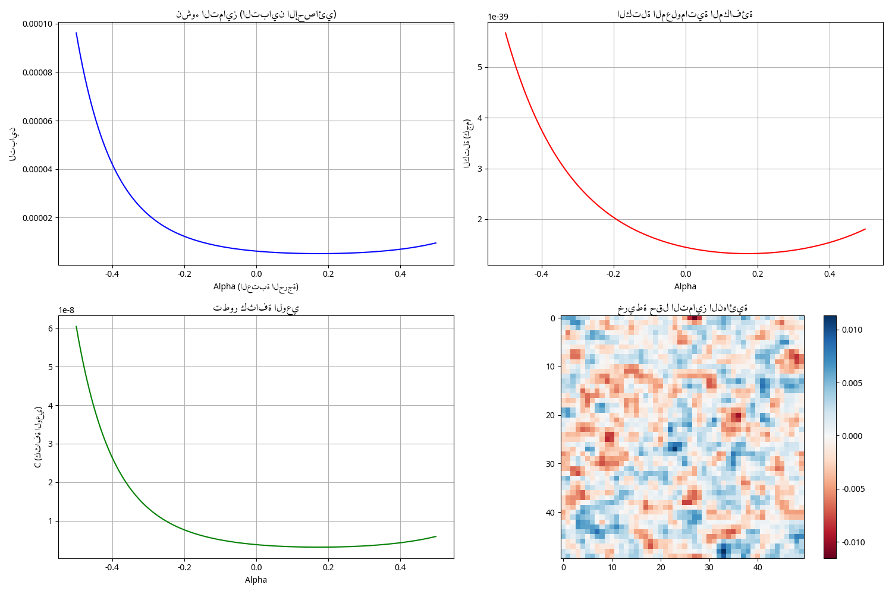

# 🌌 Creative Void (v4.0)
## A Logical and Mathematical Formulation of Existence Emerging from the Impossibility of Nothingness

**Author:** Aaron  
**Version:** 4.0 — Mathematical & Logical Reinforcement Edition

---

## 📖 Overview
The **Creative Void** theory posits that existence is not a random accident born from absolute nothingness, but a logical necessity arising from the **impossibility of absolute nothingness**. If absolute nothingness is self-contradictory and cannot be defined, then the minimum possible state is not "material" but **Differentiation**. From differentiation arises relation, from relation arises structure, from structure arises laws, and from laws emerges the universe as a self-organizing informational system.

## 🏗️ Project Architecture
This repository transforms the theoretical layers of the Creative Void into a **Digital Physics Laboratory**.

| Module | Chapter Reference | Description |
| :--- | :--- | :--- |
| `core_physics.py` | Chapter 3 | Implements the Field Equation: $\frac{\partial \Delta}{\partial t} = D_c \nabla^2\Delta + \alpha\Delta - \beta\Delta^3 + \eta$ |
| `information_mass.py` | Chapter 4 | Calculates Informational Mass using Landauer's Principle: $m_I = \frac{k_B T \ln 2}{c^2} \cdot L$ |
| `spacetime_weaver.py` | Chapter 5 | Models Spacetime as an effect of Information Attenuation (BIA Mechanism). |
| `consciousness_metrics.py` | Chapter 6 | Measures Consciousness Density: $\mathcal{C} = \frac{\nu \log_2(1+R) I_{int}}{V_{info}(1+H_{noise})}$ |
| `app.py` | Dashboard | A **Streamlit-based Interactive Lab** to visualize the theory in real-time. |

## 🚀 Getting Started

### 1. Installation
Ensure you have Python installed, then install the dependencies:
```bash
pip install numpy matplotlib scipy streamlit
```

### 2. Run the Interactive Lab
To experience the theory as a "Presentation Dashboard", run:
```bash
streamlit run app.py
```

### 3. Run the CLI Simulation
For a quick statistical output and static plots:
```bash
python main.py
```

## 📊 Visual Proof
When the simulation runs, you will witness the **Symmetry Breaking** process. As the critical threshold ($\alpha$) crosses zero, the "Void" (zero state) becomes unstable, and the system is forced into a state of differentiation.



*The plot above shows the emergence of Variance (Differentiation), Mass, and Consciousness as Alpha increases.*

## 🧠 Core Chain of Logic
$$\neg \Diamond N \Rightarrow \exists D \Rightarrow \exists Rl \Rightarrow \exists S \Rightarrow \exists I_p \Rightarrow \exists \mathcal{C}$$

> "The impossibility of nothingness leads to the necessity of differentiation, and the necessity of differentiation leads to the emergence of existence."

---
*This project is open-source. We invite physicists, programmers, and philosophers to contribute to testing the boundaries of this theory.*
